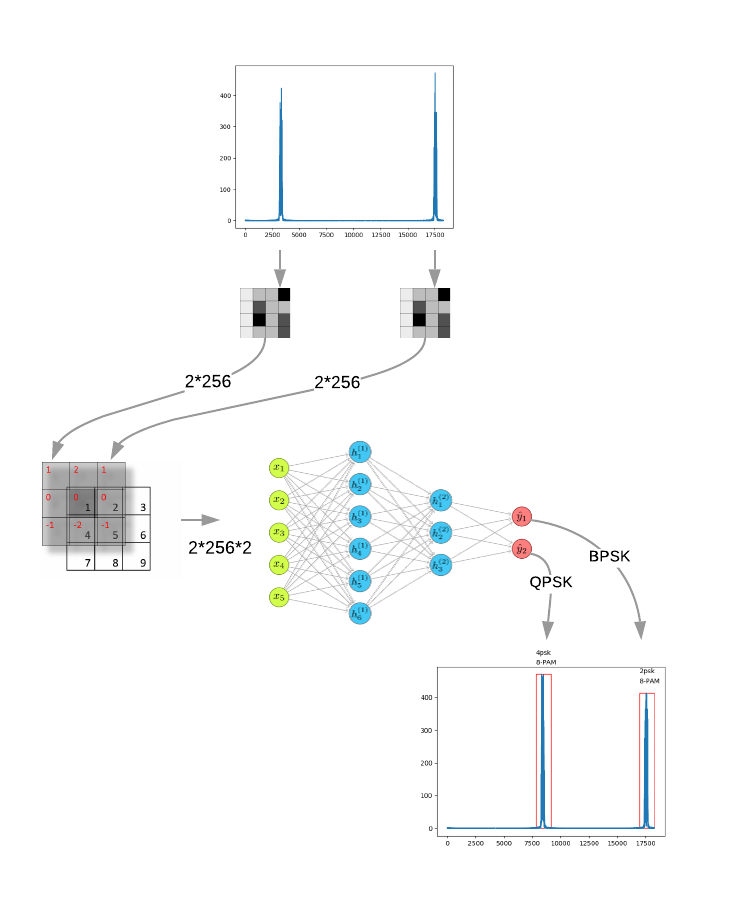

# Modulation scheme classifier

This is a flask app, Demo for a Research paper [1], which employs a long
short-term memory neural network to classify modulation scheme for
Sub-Nyquist Rate Wideband Spectrum Sensing.

#### Flow diagram of the implemented application

The link of the app would be public soon!!!!

#### References

[1] S. Chandhok, H. Joshi, S. J. Darak and A V Subramanyam, “LSTM Guided Modulation Classification and Experimental Validation
for Sub-Nyquist Rate Wideband Spectrum Sensing,” in 2019 11th International Conference on Communication Systems & Networks (COMSNETS), Jan. 2019.
